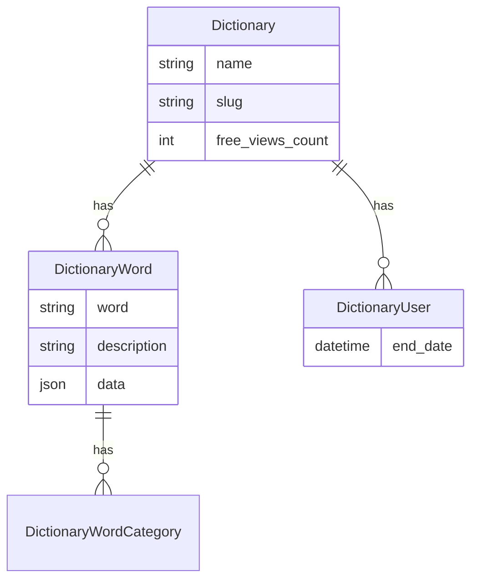

# Dictionaries

## What does it do

This package is used for managing dictionaries and their expressions. You can set the number of free views of words from a given dictionary for users who are not assigned.
This package is compatible with the purchasing process in Wellms. The dictionary may be a purchasable product.

## Entity Relationship Diagrams

The diagram below shows the relationships between entities.

## Installing

- `composer require escolalms/dictionaries`
- `php artisan migrate`
- `php artisan db:seed --class="EscolaLms\Dictionaries\Database\Seeders\DictionariesPermissionSeeder"`

## Endpoints

The endpoints are defined in 

## Tests

Run `./vendor/bin/phpunit` to run tests.
Test details 

## Events

This package does not dispatch any events.

## Listeners

This package does not listen for any events.

## Permissions

This package contains permissions which you can find in [DictionariesPermissionEnum.](https://github.com/EscolaLMS/Dictionaries/blob/main/src/Enums/DictionariesPermissionEnum.php)
The default assignment of permissions to roles is carried out after executing the command `php artisan db:seed --class="EscolaLms\Dictionaries\Database\Seeders\DictionariesPermissionSeeder"`
